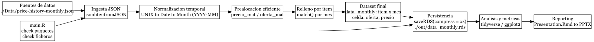

```{r setup, include=FALSE}
knitr::opts_chunk$set(
  echo = FALSE, message = FALSE, warning = FALSE,
  fig.width = 10, fig.height = 5, dpi = 300
)

library(tidyverse)
library(dplyr)
library(tidyr)
library(purrr)
library(ggplot2)
library(lubridate)
library(nortest)
library(scales)
data_month <- readRDS("./out/data_monthly.rds")

# Helper: parsea una celda a (oferta, precio) numéricos o missing
.parse_cell <- function(cell) {
  # missing: NULL real, "NULL", NA, length 0
  if (is.null(cell) || length(cell) == 0 ||
      (length(cell) == 1 && (is.na(cell) || identical(cell, "NULL")))) {
    return(list(missing = TRUE, oferta = NA_real_, precio = NA_real_))
  }
  
  # Si viene como vector/list con nombres (oferta, precio)
  if ((is.atomic(cell) || is.list(cell)) && length(cell) >= 2) {
    nm <- names(cell)
    if (!is.null(nm) && all(c("oferta", "precio") %in% nm)) {
      return(list(
        missing = FALSE,
        oferta  = as.numeric(cell[["oferta"]]),
        precio  = as.numeric(cell[["precio"]])
      ))
    }
    # Si viene sin nombres pero con dos valores (oferta, precio)
    if (length(cell) == 2) {
      return(list(
        missing = FALSE,
        oferta = as.numeric(cell[[1]]),
        precio = as.numeric(cell[[2]])
      ))
    }
  }
  
  # Si viene como string "0.00, 0.27"
  if (is.character(cell) && length(cell) == 1) {
    parts <- strsplit(cell, ",", fixed = TRUE)[[1]]
    if (length(parts) >= 2) {
      return(list(
        missing = FALSE,
        oferta = as.numeric(trimws(parts[1])),
        precio = as.numeric(trimws(parts[2]))
      ))
    }
  }
  
  # Fallback: si hay algún formato raro
  warning("Formato de celda no reconocido; se deja como missing. str(cell): ",
          paste(capture.output(str(cell)), collapse = " "))
  list(missing = TRUE, oferta = NA_real_, precio = NA_real_)
}

fix_zero_prices_locf <- function(df, id_col = "nombre") {
  month_cols <- setdiff(names(df), id_col)
  month_cols <- month_cols[order(as.Date(paste0(month_cols, "-01")))]
  
  # Asegura list-cols (para poder guardar NULL y pares oferta/precio)
  for (col in month_cols) {
    if (!is.list(df[[col]])) df[[col]] <- as.list(df[[col]])
  }
  
  # Normaliza: cada celda -> NULL o c(oferta=..., precio=...) numérico
  df[month_cols] <- lapply(df[month_cols], function(col) {
    lapply(col, function(cell) {
      p <- .parse_cell(cell)
      if (p$missing) return(NULL)
      c(oferta = p$oferta, precio = p$precio)
    })
  })
  
  # Extrae matrices numéricas (rápido para aplicar LOCF por fila)
  oferta <- sapply(df[month_cols], function(col)
    vapply(col, function(cell) if (is.null(cell)) NA_real_ else unname(cell[["oferta"]]), numeric(1))
  )
  precio <- sapply(df[month_cols], function(col)
    vapply(col, function(cell) if (is.null(cell)) NA_real_ else unname(cell[["precio"]]), numeric(1))
  )
  
  # Corrige por fila: si oferta==0 & precio==0 => precio = último precio > 0 anterior
  for (i in seq_len(nrow(df))) {
    last_pos <- NA_real_
    for (j in seq_along(month_cols)) {
      o <- oferta[i, j]
      p <- precio[i, j]
      
      if (!is.na(p) && p > 0) last_pos <- p
      
      if (!is.na(o) && o == 0 && !is.na(p) && p == 0 && !is.na(last_pos)) {
        precio[i, j] <- last_pos
      }
    }
  }
  
  # Vuelca precios al df (manteniendo NULL intactos)
  for (j in seq_along(month_cols)) {
    colname <- month_cols[j]
    col <- df[[colname]]
    newp <- precio[, j]
    
    for (i in seq_along(col)) {
      cell <- col[[i]]
      if (is.null(cell)) next
      cell[["precio"]] <- newp[[i]]
      col[[i]] <- cell
    }
    df[[colname]] <- col
  }
  
  df
}

data_month_adjusted <- fix_zero_prices_locf(data_month)

df_long <- data_month_adjusted %>%
  pivot_longer(
    cols = -nombre,
    names_to = "fecha",
    values_to = "valor"
  ) %>% 
  mutate(
    oferta = map_dbl(valor, \(x) {
      if (is.null(x)) return(NA_real_)
      as.numeric(x["oferta"])
    }),
    precio = map_dbl(valor, \(x) {
      if (is.null(x)) return(NA_real_)
      as.numeric(x["precio"])
    })
  ) %>%
  select(-valor)

mercado_media <- df_long %>%
  filter(!(oferta == 0 & precio == 0)) %>%
  group_by(fecha) %>%
  summarise(
    media_precio  = mean(precio,  na.rm = TRUE),
    media_demanda = mean(oferta,  na.rm = TRUE),
    
    suma_precios  = sum(precio,   na.rm = TRUE),
    suma_demanda  = sum(oferta,   na.rm = TRUE),
    .groups = "drop"
  ) %>%
  arrange(fecha) %>%
  mutate(mes_num = row_number())

mercado_media_demanda <- mercado_media %>% 
  filter(fecha >= "2023-02")

mercado_var <- df_long %>%
  filter(!(oferta == 0 & precio == 0)) %>%
  group_by(fecha) %>%
  summarise(
    var_precio   = var(precio,  na.rm = TRUE),
    var_demanda  = var(oferta,  na.rm = TRUE),
    n_obs        = sum(!is.na(precio) & !is.na(oferta)),
    .groups = "drop"
  ) %>%
  arrange(fecha) %>%
  mutate(mes_num = row_number())

df_year_weapon <- df_long %>%
  mutate(
    fecha = ym(fecha),
    year  = year(fecha)
  ) %>%
  group_by(year, nombre) %>%
  summarise(
    media_precio  = mean(precio, na.rm = TRUE),
    media_demanda = mean(oferta, na.rm = TRUE),
    .groups = "drop"
  )

df_year_weapon %>%
  filter(media_precio > 0) %>% # para log10
  mutate(x = log10(media_precio)) %>%
  group_by(year) %>%
  summarise(
    n = n(),
    shapiro_p = if (n() <= 5000) shapiro.test(x)$p.value else shapiro.test(sample(x, 5000))$p.value,
    ad_p      = nortest::ad.test(x)$p.value,
    lillie_p  = nortest::lillie.test(x)$p.value,
    .groups = "drop"
  )

df_year_weapon_dem <- df_long %>%
  mutate(fecha = ym(fecha)) %>%
  filter(fecha >= ym("2023-02")) %>%
  mutate(year = year(fecha)) %>%
  group_by(year, nombre) %>%
  summarise(media_demanda = mean(oferta, na.rm = TRUE), .groups = "drop")

# Helpers robustos
safe_quantile <- function(x, p) {
  x <- x[is.finite(x)]
  if (length(x) == 0) return(NA_real_)
  as.numeric(quantile(x, probs = p, na.rm = TRUE, names = FALSE))
}

safe_median <- function(x) {
  x <- x[is.finite(x)]
  if (length(x) == 0) return(NA_real_)
  median(x, na.rm = TRUE)
}

safe_cor <- function(a, b) {
  ok <- is.finite(a) & is.finite(b)
  if (sum(ok) < 3) return(NA_real_)
  cor(a[ok], b[ok])
}


# 1..7) Métricas MENSUALES (volumen, turnover, vwap, percentiles, breadth, concentración, correlación)
metrics_mes <- df_long %>%
  mutate(
    fecha = ym(fecha),
    dem_ok = fecha >= ym("2023-02")   # demanda fiable desde feb-2023
  ) %>%
  filter(!(oferta == 0 & precio == 0)) %>%      # quita solo los 0/0
  group_by(fecha) %>%
  summarise(
    # (1) Volumen mensual real (unidades)
    volumen_unidades = sum(oferta[dem_ok & oferta > 0], na.rm = TRUE),
    
    # (2) Valor transaccionado mensual (turnover)
    turnover = sum((precio * oferta)[dem_ok & oferta > 0 & precio > 0], na.rm = TRUE),
    
    # (3) Precio ponderado por volumen (VWAP)
    vwap = if_else(volumen_unidades > 0, turnover / volumen_unidades, NA_real_),
    
    # (4) Precio robusto: mediana + percentiles (sobre distribución cross-section del mes)
    mediana_precio = safe_median(precio[precio > 0]),
    p10_precio     = safe_quantile(precio[precio > 0], 0.10),
    p90_precio     = safe_quantile(precio[precio > 0], 0.90),
    
    # (5) Breadth / amplitud: ítems con ventas y proporción activos
    items_con_dato = n_distinct(nombre[!is.na(precio) | !is.na(oferta)]),
    items_activos  = n_distinct(nombre[dem_ok & oferta > 0]),
    prop_activos   = if_else(items_con_dato > 0, items_activos / items_con_dato, NA_real_),
    
    # (7) Correlación precio–demanda (cross-section del mes; en log para estabilidad)
    cor_log_precio_dem = safe_cor(log(precio), log1p(oferta)),
    
    .groups = "drop"
  ) %>%
  arrange(fecha) %>%
  mutate(mes_num = row_number())

# (6) Concentración: Top-10 share + HHI (por volumen y por turnover)
conc_mes <- df_long %>%
  mutate(fecha = ym(fecha)) %>%
  filter(fecha >= ym("2023-02")) %>%                 # demanda fiable
  filter(!(oferta == 0 & precio == 0)) %>%
  group_by(fecha, nombre) %>%
  summarise(
    vol_item = sum(oferta[oferta > 0], na.rm = TRUE),
    val_item = sum((precio * oferta)[oferta > 0 & precio > 0], na.rm = TRUE),
    .groups = "drop"
  ) %>%
  group_by(fecha) %>%
  summarise(
    top10_share_vol = if_else(sum(vol_item, na.rm = TRUE) > 0,
                              sum(sort(vol_item, decreasing = TRUE)[1:min(10, n())], na.rm = TRUE) / sum(vol_item, na.rm = TRUE),
                              NA_real_),
    hhi_vol = if_else(sum(vol_item, na.rm = TRUE) > 0,
                      sum((vol_item / sum(vol_item, na.rm = TRUE))^2, na.rm = TRUE),
                      NA_real_),
    
    top10_share_val = if_else(sum(val_item, na.rm = TRUE) > 0,
                              sum(sort(val_item, decreasing = TRUE)[1:min(10, n())], na.rm = TRUE) / sum(val_item, na.rm = TRUE),
                              NA_real_),
    hhi_val = if_else(sum(val_item, na.rm = TRUE) > 0,
                      sum((val_item / sum(val_item, na.rm = TRUE))^2, na.rm = TRUE),
                      NA_real_),
    .groups = "drop"
  ) %>%
  arrange(fecha)

# Une concentración a la tabla mensual principal
metrics_mes <- metrics_mes %>%
  left_join(conc_mes, by = "fecha")

# (8) Iliquidez por ÍTEM: % meses sin ventas + racha máxima sin ventas (desde feb-2023)
illiquidez_item <- df_long %>%
  mutate(fecha = ym(fecha)) %>%
  filter(fecha >= ym("2023-02")) %>%
  filter(!(oferta == 0 & precio == 0)) %>%
  group_by(nombre) %>%
  arrange(fecha, .by_group = TRUE) %>%
  summarise(
    meses_con_dato = sum(!is.na(oferta) | !is.na(precio)),
    meses_sin_ventas = sum(!is.na(oferta) & oferta == 0),
    prop_meses_sin_ventas = if_else(meses_con_dato > 0, meses_sin_ventas / meses_con_dato, NA_real_),
    
    # racha máxima de meses consecutivos con oferta == 0 (solo en meses con dato)
    max_racha_sin_ventas = {
      idx <- which(!is.na(oferta) | !is.na(precio))
      if (length(idx) == 0) NA_integer_ else {
        z <- (!is.na(oferta[idx]) & oferta[idx] == 0)
        r <- rle(z)
        if (any(r$values)) max(r$lengths[r$values]) else 0L
      }
    },
    
    .groups = "drop"
  ) %>%
  arrange(desc(prop_meses_sin_ventas))

metrics_plot <- metrics_mes %>%
  mutate(fecha = as.Date(fecha)) %>%
  filter(fecha >= as.Date(ym("2023-02"))) %>%
  arrange(fecha)

illiq_plot <- illiquidez_item %>%
  filter(!is.na(prop_meses_sin_ventas)) %>%
  mutate(prop_meses_sin_ventas = pmin(pmax(prop_meses_sin_ventas, 0), 1))

fmt_si <- scales::label_number(scale_cut = scales::cut_si(" "))
```

## Indice

-   Introducción

-   Tratado de datos

-   Estadísticas del mercado

-   Probabilidad de las cajas

-   Conclusión

# Tratado de datos



# Evolución del precio mensual del mercado

```{r}
ggplot(mercado_media, aes(x = as.numeric(factor(fecha)), y = suma_precios)) +
  geom_col(aes(x = as.numeric(factor(fecha))), fill = "steelblue") +
  scale_x_continuous(
    breaks = seq_along(mercado_media$fecha),
    labels = mercado_media$fecha
  ) +
  theme_minimal(base_size = 14) +
  labs(
    title = "Evolución del precio menusal del mercado",
    x = "Mes",
    y = "Precio medio (CN¥)"
  ) +
  theme(axis.text.x = element_text(angle = 45, hjust = 1))
```

# Evolución de la demanda mensual del mercado

```{r}
mercado_media_demanda <- mercado_media %>% 
  filter(fecha >= "2023-02")

ggplot(mercado_media_demanda, aes(x = mes_num, y = suma_demanda)) +
  geom_col(fill = "orange") +
  scale_x_continuous(
    breaks = mercado_media_demanda$mes_num,
    labels = mercado_media_demanda$fecha
  ) +
  theme_minimal(base_size = 14) +
  labs(
    title = "Evolución de la demanda mensual del mercado",
    x = "Mes",
    y = "Demanda (unidades)"
  ) +
  theme(axis.text.x = element_text(angle = 45, hjust = 1))
```

# Precio mensual de los items (boxplot, escala log)

```{r, fig.height=5.8}
ggplot(df_long %>% filter(!(oferta == 0 & precio == 0)), aes(x = fecha, y = precio)) +
  geom_boxplot(fill = "skyblue") +
  scale_y_log10() +
  theme_minimal(base_size = 14) +
  labs(
    title = "Precio mensual de las skins (escala log)",
    x = "Mes",
    y = "Precio (CN¥)"
  ) +
  theme(axis.text.x = element_text(angle = 45, hjust = 1))
```

# Demanda mensual de los items (boxplot, escala log)

```{r, fig.height=5.8}
ggplot(df_long %>% filter(!(oferta == 0 & precio == 0), fecha >= "2023-02") , aes(x = fecha, y = oferta)) +
  geom_boxplot(fill = "orange") +
  scale_y_log10() +
  theme_minimal(base_size = 14) +
  labs(
    title = "Demanda mensual de las skins (escala log)",
    x = "Mes",
    y = "Demanda"
  ) +
  theme(axis.text.x = element_text(angle = 45, hjust = 1))
```

# QQ-plot de precio medio por arma (log10) — por año

```{r, fig.height=6.2}
df_year_weapon %>%
  filter(media_precio > 0) %>%
  mutate(x = log10(media_precio)) %>%
  ggplot(aes(sample = x)) +
  stat_qq() +
  stat_qq_line() +
  facet_wrap(~ year, scales = "free") +
  theme_minimal()
```

# QQ-plot de demanda media por arma (log1p) — por año

```{r, fig.height=6.2}
df_year_weapon_dem %>%
  mutate(x = log1p(media_demanda)) %>%
  ggplot(aes(sample = x)) +
  stat_qq() +
  stat_qq_line() +
  facet_wrap(~ year, scales = "free") +
  theme_minimal(base_size = 14) +
  labs(
    title = "QQ-plot de la demanda media por arma (log1p) — por año",
    x = "Cuantiles teóricos (Normal)",
    y = "Cuantiles muestrales (log(1 + media de oferta))"
  )
```

# Precio medio mensual del mercado

```{r, fig.height=5.8}
ggplot(mercado_media, aes(x = as.numeric(factor(fecha)), y = media_precio)) +
  geom_col(aes(x = as.numeric(factor(fecha))), fill = "steelblue") +
  geom_smooth(method = "lm", se = FALSE, linewidth = 1.2, color = "darkgreen") +
  scale_x_continuous(
    breaks = seq_along(mercado_media$fecha),
    labels = mercado_media$fecha
  ) +
  theme_minimal(base_size = 14) +
  labs(
    title = "Evolución del precio medio menusal del mercado",
    x = "Mes",
    y = "Precio medio (CN¥)"
  ) +
  theme(axis.text.x = element_text(angle = 45, hjust = 1))
```

# Demanda media mensual del mercado (ajuste logarítmico)

```{r, fig.height=5.8}
ggplot(mercado_media_demanda, aes(x = mes_num, y = media_demanda)) +
  geom_col(fill = "orange") +
  stat_smooth(
    method = "lm",
    formula = y ~ log(x),
    se = FALSE,
    linewidth = 1.2,
    color = "darkred"
  ) +
  scale_x_continuous(
    breaks = mercado_media_demanda$mes_num,
    labels = mercado_media_demanda$fecha
  ) +
  theme_minimal(base_size = 14) +
  labs(
    title = "Evolución de la demanda media mensual del mercado",
    subtitle = "Ajuste logarítmico",
    x = "Mes",
    y = "Demanda media (unidades)"
  ) +
  theme(axis.text.x = element_text(angle = 45, hjust = 1))
```

# Varianza mensual del precio del mercado

```{r, fig.height=5.8}
ggplot(mercado_var, aes(x = as.numeric(factor(fecha)), y = var_precio)) +
  geom_col(fill = "steelblue") +
  scale_x_continuous(
    breaks = seq_along(mercado_var$fecha),
    labels = mercado_var$fecha
  ) +
  theme_minimal(base_size = 14) +
  labs(
    title = "Evolución de la varianza mensual del precio del mercado",
    x = "Mes",
    y = "Varianza del precio (CN¥²)"
  ) +
  theme(axis.text.x = element_text(angle = 45, hjust = 1))
```

# Varianza mensual de la demanda del mercado

```{r, fig.height=5.8}
ggplot(mercado_var %>% filter(fecha >= "2023-02"), aes(x = mes_num, y = var_demanda)) +
  geom_col(fill = "orange") +
  scale_x_continuous(
    breaks = mercado_var$mes_num,
    labels = mercado_var$fecha
  ) +
  theme_minimal(base_size = 14) +
  labs(
    title = "Evolución de la varianza mensual de la demanda del mercado",
    x = "Mes",
    y = "Varianza de la demanda (unidades²)"
  ) +
  theme(axis.text.x = element_text(angle = 45, hjust = 1))
```

# Distribución de medias de valor por arma (por año)

```{r, fig.height=6.2}
ggplot(df_year_weapon %>% filter(media_precio > 0),
       aes(x = media_precio)) +
  geom_histogram(aes(y = after_stat(density)), bins = 60)+
  scale_x_log10() +
  facet_wrap(~ year, scales = "free_y") +
  theme_minimal(base_size = 14) +
  labs(
    title = "Distribución de medias de valor por arma por año",
    x = "Media de precio (CN¥, escala log10)",
    y = "Frecuencia relativa"
  )
```

# Distribución de medias de demanda por arma (por año)

```{r, fig.height=6.2}
ggplot(df_year_weapon_dem, aes(x = log1p(media_demanda))) +
  geom_histogram(aes(y = after_stat(density)), bins = 60) +
  facet_wrap(~ year, scales = "free_y") +
  theme_minimal(base_size = 14) +
  labs(
    title = "Distribución de medias de demanda por arma por año",
    x = "log(1 + media de oferta)",
    y = "Frecuencia relativa"
  )
```

# Actividad del mercado (volumen de unidades)

```{r, fig.height=5.5}
ggplot(metrics_plot, aes(x = fecha, y = volumen_unidades)) +
  geom_line(linewidth = 1) +
  scale_y_continuous(labels = fmt_si) +
  theme_minimal(base_size = 14) +
  labs(
    title = "Actividad del mercado",
    subtitle = "Volumen mensual (unidades vendidas)",
    x = "Fecha", y = "Volumen (unidades)"
  )
```

# Tamaño económico del mercado (turnover mensual)

```{r, fig.height=5.5}
ggplot(metrics_plot, aes(x = fecha, y = turnover)) +
  geom_line(linewidth = 1) +
  scale_y_continuous(labels = fmt_si) +
  theme_minimal(base_size = 14) +
  labs(
    title = "Tamaño económico del mercado",
    subtitle = "Turnover mensual = Σ (precio × unidades)",
    x = "Fecha", y = "Turnover (CN¥)"
  )
```

# Índice de precio del mercado (mediana + banda P10–P90 + VWAP)

```{r, fig.height=5.8}
ggplot(metrics_plot, aes(x = fecha)) +
  geom_ribbon(aes(ymin = p10_precio, ymax = p90_precio), alpha = 0.20) +
  geom_line(aes(y = mediana_precio), linewidth = 1) +
  geom_line(aes(y = vwap), linewidth = 1, linetype = "dashed") +
  scale_y_log10(labels = fmt_si) +
  theme_minimal(base_size = 14) +
  labs(
    title = "Índice de precio del mercado",
    subtitle = "Mediana (línea) + banda P10–P90 + VWAP (discontinua) — escala log",
    x = "Fecha", y = "Precio (CN¥, log10)"
  )
```

# Liquidez global (ítems activos)

```{r, fig.height=5.5}
ggplot(metrics_plot, aes(x = fecha, y = prop_activos)) +
  geom_line(linewidth = 1) +
  scale_y_continuous(labels = percent_format(accuracy = 1)) +
  theme_minimal(base_size = 14) +
  labs(
    title = "Liquidez global (breadth)",
    subtitle = "% de ítems con ventas sobre ítems con datos",
    x = "Fecha", y = "% ítems activos"
  )
```

# Concentración del mercado (Top-10 share por turnover)

```{r, fig.height=5.5}
ggplot(metrics_plot, aes(x = fecha, y = top10_share_val)) +
  geom_line(linewidth = 1) +
  scale_y_continuous(labels = percent_format(accuracy = 1)) +
  theme_minimal(base_size = 14) +
  labs(
    title = "Concentración del mercado",
    subtitle = "Share del Top-10 por turnover",
    x = "Fecha", y = "Top-10 share (turnover)"
  )
```

# Relación precio–demanda (correlación cross-section por mes)

```{r, fig.height=5.5}
ggplot(metrics_plot, aes(x = fecha, y = cor_log_precio_dem)) +
  geom_hline(yintercept = 0, linewidth = 0.6) +
  geom_line(linewidth = 1) +
  theme_minimal(base_size = 14) +
  labs(
    title = "Relación precio–demanda (por mes)",
    subtitle = "Correlación cross-section: cor(log(precio), log(1 + oferta))",
    x = "Fecha", y = "Correlación"
  )
```

# Distribución de iliquidez por ítem

```{r, fig.height=5.8}
ggplot(illiq_plot, aes(x = prop_meses_sin_ventas)) +
  geom_histogram(aes(y = after_stat(count / sum(count))), bins = 40) +
  scale_x_continuous(labels = percent_format(accuracy = 1)) +
  scale_y_continuous(labels = percent_format(accuracy = 1)) +
  theme_minimal(base_size = 14) +
  labs(
    title = "Distribución de iliquidez por ítem",
    subtitle = "% de meses sin ventas (desde feb-2023) — frecuencia relativa",
    x = "% meses sin ventas",
    y = "Frecuencia relativa"
  )
```

## Tabla de probabilidades de items

Cada item de cualquier caja pertenece a una de las siguientes categorías:

```{r}
probs <- data.frame(category=c("Mil-Spec", "Restricted", "Classified", "Covert", "Special Item"), prob=c(0.79923, 0.15985, 0.03197, 0.00639, 0.00256))

probs
```

## Probabilidad de StatTrak

Usamos la distribución uniforme con el metodo *runif* que genera valores aleatorios entre un mínimo y máximo. Cada arma tiene una probabilidad del 10% de tener StatTrak:

```{r, echo=T, eval=F}
runif(1) < 0.10 # Genera un valor aleatorio entre 0 y 1 (primer argumento es el número de valores a generar, NO las cotas)
```

## Probabilidad de desgaste

Se decide mediante la formula: $$Wear = Min + (Random \times (Max - Min))$$

-   Min: Mínimo desgaste del arma
-   Max: Máximo desgaste del arma
-   Random: Número aleatorio entre 0 y 1

## Probabilidad de desgaste

Clasificación del desgaste en función del desgaste calculado:

```{r}
wear <- list(
  names = c("Factory New", "Minimal Wear", "Field-Tested", "Well-Worn", "Battle-Scarred"),
  breaks = c(0.00, 0.07, 0.15, 0.38, 0.45, 1.00)
)

data.frame(wear$names, lower = c(0.00, 0.07, 0.15, 0.38, 0.45),
           upper = c(0.07, 0.15, 0.38, 0.45, 1.00))
```

## Rentabilidad del Fracture Case

```{r, message=F, warning=F}
library(tidyverse)
library(dplyr)
library(tidyr)
library(purrr)
library(ggplot2)
library(lubridate)
data_month <- readRDS("./out/data_monthly.rds")
df_long_filtered <- data_month %>%
  pivot_longer(
    cols = -nombre,
    names_to = "fecha",
    values_to = "valor"
  ) %>% 
  mutate(
    precio = map_dbl(valor, function(x) {
      if (is.null(x)) return(NA_real_)
      as.numeric(x["precio"])
    }),
    oferta = map_dbl(valor, function(x) {
      if (is.null(x)) return(NA_real_)
      as.numeric(x["oferta"])
    })
  )
```

```{r}
fracture_weapons <- c("Negev | Ultralight",
                      "P2000 | Gnarled",
                      "SG 553 | Ol' Rusty",
                      "SSG 08 | Mainframe 001",
                      "P250 | Cassette",
                      "P90 | Freight",
                      "PP-Bizon | Runic",
                      "MAG-7 | Monster Call",
                      "Tec-9 | Brother",
                      "MAC-10 | Allure",
                      "Galil AR | Connexion",
                      "MP5-SD | Kitbash",
                      "M4A4 | Tooth Fairy",
                      "Glock-18 | Vogue",
                      "XM1014 | Entombed",
                      "Desert Eagle | Printstream",
                      "AK-47 | Legion of Anubis",
                      "Special Item")

rarity <- c(7, 5, 3, 2, 1) # Cuantos items de la caja pertenecen a cada categoría (los 7 primeros a Mil-Spec, los siguientes 5 a Restricted, y así sucesivamente).

fracture_case <- data.frame(weapons=fracture_weapons, probs=rep(probs$prob/rarity, rarity))
```

```{r}
fracture_case$min_wear = c(0.00, 0.00, 0.00, 0.00, 0.00, 0.00, 0.00, 0.00, 0.00, 0.00, 
                           0.00, 0.00, 0.00, 0.00, 0.00, 0.00, 0.00, 0.00) # los desgastes minimos de las armas

fracture_case$max_wear = c(0.78, 1.00, 1.00, 1.00, 0.60, 1.00, 1.00, 1.00, 1.00, 1.00, 
                           0.80, 0.80, 0.73, 0.75, 0.50, 0.80, 0.70, 1.00) # los desgastes
```

```{r}
gamble <- function(n_items, date) {
  samp <- data.frame(weapons=sample(fracture_case$weapons, n_items, replace=T, fracture_case$probs)) # Cogemos los nombres de n_items aleatoriamente
  
  samp$stat = runif(n_items) < 0.10 # Tiene StatTrak? (10% probabilidad)
  
  indexes <- match(samp$weapons, fracture_case$weapons)
  samp$wear <- cut(fracture_case$min_wear[indexes] + (runif(nrow(samp)) * (fracture_case$max_wear[indexes] - fracture_case$min_wear[indexes])), 
                   wear$breaks, 
                   wear$names) # Calculamos el desgaste del arma y clasificamos ese desgaste
  
  
  df_date <- df_long_filtered %>% filter(fecha == date) # Cogemos los precios de un mes en particular
  
  samp$weapons <- ifelse(
    samp$weapons == "Special Item",
    
    sample((df_date %>% filter(grepl("Knife", nombre))) %>% pull(nombre), n_items), # Cogemos un cuchillo si nos ha tocado un item special.
    
    paste0(ifelse(samp$stat, "StatTrak™ ",  ""), samp$weapons, " (", samp$wear, ")")) # Construimos la string del arma con su desgaste y si tiene StatTrak.
  
  samp$price <- (df_date %>% pull(precio))[match(samp$weapons, df_date %>% pull(nombre))] # Cogemos el precio del item elegido
  
  return(samp) # Retornamos el dataframe conteniendo todos los items que hemos sacado de la caja
}
```

```{r, warning=F}
beneficios <- replicate(100, sum(gamble(10, "2023-03")$price) - 17.60 * 10) # 100 simulaciones en las que abres 10 cajas

ggplot() + geom_histogram(aes(x=beneficios[beneficios > 0], y=..density..), fill="darkgreen", bins = 60) +
  geom_histogram(aes(x=beneficios[beneficios < 0], y=-..density..), fill="darkred", bins = 60) +
  labs(title="Beneficios de abrir 10 cajas para 100 simulaciones", x="Beneficios", y="Densidad") +
  geom_hline(yintercept = 0) +
  geom_vline(xintercept = 0)
```

## Rentabilidad del Fracture Case

Beneficios de algunas simulaciones:

```{r}
head(data.frame(simulación=1:100,beneficios))
```

La mayoría de las simulaciones retornan beneficios negativos

## Rentabilidad del Fracture Case

Suma de beneficios totales de todas las simulaciones:

```{r, echo=T}
sum(beneficios)
```
